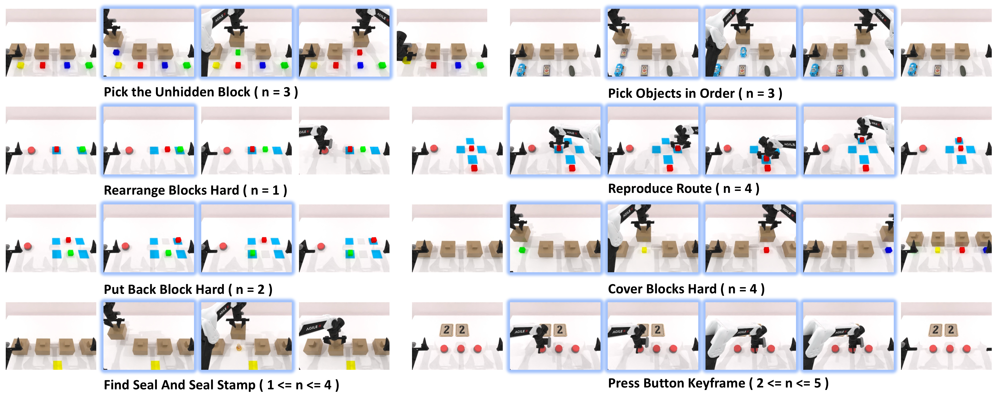

# EventVLA

**EventVLA: Event-Driven Visual Evidence Memory for Long-Horizon Vision-Language-Action Policies**

EventVLA is a vision-language-action framework for long-horizon robotic manipulation. It introduces event-driven visual evidence memory: the policy detects task-relevant events, stores key visual evidence as raw keyframe images, and reuses this memory during action prediction.

This repository is released together with **RoboTwin-Mem**, a memory-dependent manipulation benchmark built on RoboTwin 2.0.

<p align="center">
  
</p>
<p align="center">
  
</p>


## Released Resources

### Model Checkpoints

Model repository:

https://huggingface.co/ganlinyang/EventVLA/tree/main

| Checkpoint   | Usage                                               | Recommended file                            |
| ------------ | --------------------------------------------------- | ------------------------------------------- |
| RoboTwin-MeM | EventVLA evaluation on the eight RoboTwin-MeM tasks | `RoboTwin-MeM/final_model/pytorch_model.pt` |
| RMBench      | Evaluation on the RMBench benchmark                 | `RMBench/final_model/pytorch_model.pt`      |

Each release also contains:

```text
checkpoints/steps_100000_pytorch_model.pt
final_model/pytorch_model.pt
config.yaml
dataset_statistics.json
summary.jsonl
```

Use the RoboTwin-MeM checkpoint with the RoboTwin-MeM evaluation scripts. The RMBench checkpoint should be used with the corresponding RMBench environment and evaluation configuration.

### RoboTwin-MeM Dataset

Dataset repository:

https://huggingface.co/datasets/ganlinyang/RoboTwin-MeM

The dataset contains:

```text
RoboTwin-MeM/
├── hdf5/          # HDF5 trajectories
└── lerobot_2.1/   # LeRobot 2.1 training data
```

Both formats contain the following eight tasks:

```text
cover_blocks_hard
find_seal_and_seal_stamp
pick_objects_in_order
pick_the_unhidden_block
press_button_keyframe
put_back_block_hard
rearrange_blocks_hard
reproduce_route
```

## Installation

We recommend using two conda environments: one for RoboTwin-Mem simulation, and one for EventVLA model training / inference.

### RoboTwin-MeM Environment

```bash
conda create -n RoboTwin-MeM python=3.10 -y
conda activate RoboTwin-MeM

cd /path/to/RoboTwin-MeM
pip install -r script/requirements.txt
bash script/_install.sh
```

Download the simulation assets:

```bash
cd /path/to/RoboTwin-MeM
bash script/_download_assets.sh
```

### EventVLA Environment

```bash
conda create -n eventvla python=3.10 -y
conda activate eventvla

cd /path/to/EventVLA
pip install -r requirements.txt
pip install flash-attn --no-build-isolation
pip install -e .
```


Download the released resources from Hugging Face:

EventVLA checkpoints: https://huggingface.co/ganlinyang/EventVLA
RoboTwin-MeM dataset: https://huggingface.co/datasets/ganlinyang/RoboTwin-MeM

We recommend organizing them as follows:

workspace/
├── checkpoints/
│   └── EventVLA/
│       ├── RoboTwin-MeM/
│       │   ├── final_model/pytorch_model.pt
│       │   ├── config.yaml
│       │   └── dataset_statistics.json
│       └── RMBench/
│           ├── final_model/pytorch_model.pt
│           ├── config.yaml
│           └── dataset_statistics.json
└── data/
    └── RoboTwin-MeM/
        ├── lerobot_2.1/
        └── hdf5/

Use the RoboTwin-MeM checkpoint for RoboTwin-MeM evaluation and the RMBench checkpoint for RMBench evaluation.

## Evaluation

### Single-Task Evaluation

Start an EventVLA policy server:

```bash
cd /path/to/EventVLA

EVENTVLA_PYTHON=/path/to/eventvla/env/bin/python \
bash examples/RoboTwin-Mem/eval_files/run_policy_server.sh \
  /path/to/checkpoint.pt \
  0 \
  5840
```

Run RoboTwin-Mem evaluation:

```bash
cd /path/to/EventVLA

ROBOTWIN_MEM_ROOT=/path/to/RoboTwin-Mem \
ROBOTWIN_MEM_PYTHON=/path/to/RoboTwin-Mem/env/bin/python \
POLICY_CKPT_PATH=/path/to/checkpoint.pt \
HOST=127.0.0.1 \
PORT=5840 \
UNNORM_KEY=robotwin_mem \
bash examples/RoboTwin-Mem/eval_files/eval.sh \
  cover_blocks_hard \
  demo_clean \
  pure_image_keyframe_memory \
  0 \
  0
```

The arguments are:

```text
bash eval.sh <task_name> <task_config> [ckpt_setting] [seed] [gpu_id]
```

### Batch Evaluation

Run the default 8-task batch evaluation:

```bash
cd /path/to/EventVLA

bash examples/RoboTwin-Mem/eval_batch/run_batch_eval.sh \
  examples/RoboTwin-Mem/eval_batch/weights_8tasks_pure_image_keyframe_memory_teacher_qwenoft.sh
```

Before running, edit the weight config file and replace local checkpoint / Python paths with your own paths:

```bash
EVENTVLA_PYTHON="/path/to/eventvla/env/bin/python"
ROBOTWIN_MEM_PYTHON="/path/to/RoboTwin-Mem/env/bin/python"
ROBOTWIN_MEM_ROOT="/path/to/RoboTwin-Mem"

WEIGHT_TASK1="/path/to/checkpoint.pt"
CKPT_SETTING_TASK1="pure_image_keyframe_memory"
```

### Evaluation Outputs

Batch evaluation summary:

```text
examples/RoboTwin-Mem/eval_batch/logs/batch_eval/<RUN_TAG>/summary.csv
```

Per-task logs:

```text
examples/RoboTwin-Mem/eval_batch/logs/batch_eval/<RUN_TAG>/round_<ROUND_ID>/
```

RoboTwin-Mem result files:

```text
RoboTwin-Mem/eval_result/<task>/<policy_name>/<task_config>/<ckpt_setting>/<timestamp>/
├── _result.txt
└── eval_log.txt
```

## Training

Training scripts are under:

```text
examples/RoboTwin-Mem/train_files/
```


### Single-Node Training

```bash
cd "${EVENTVLA_ROOT}"

BASE_VLM="${BASE_VLM}" \
ROBOTWIN_MEM_DATA_ROOT="${ROBOTWIN_MEM_DATA_ROOT}" \
bash examples/RoboTwin-Mem/train_files/run_eventvla_train.sh
```

The data root can also be passed as the first argument:

```bash
bash examples/RoboTwin-Mem/train_files/run_eventvla_train.sh \
  "${ROBOTWIN_MEM_DATA_ROOT}"
```

### SLURM Training

```bash
cd "${EVENTVLA_ROOT}"

BASE_VLM="${BASE_VLM}" \
ROBOTWIN_MEM_DATA_ROOT="${ROBOTWIN_MEM_DATA_ROOT}" \
sbatch examples/RoboTwin-Mem/train_files/run_eventvla_train_batch.sh
```

Alternatively:

```bash
sbatch examples/RoboTwin-Mem/train_files/run_eventvla_train_batch.sh \
  "${ROBOTWIN_MEM_DATA_ROOT}"
```

The released RoboTwin-MeM configuration uses:

```text
memory_ablation_mode: pure_image_keyframe_memory
keyframe_image_memory.enabled: true
keyframe_train_memory_source: teacher_to_predict
keyframe_eval_memory_source: predict
max_keyframes: 4
temporal image anchors: first frame, t-30, t-15, current frame
action horizon: 50
maximum training steps: 100000
```

Training checkpoints are written under:

```text
EventVLA/results/Checkpoints/<run_id>/checkpoints/
```

Typical checkpoint names are:

```text
steps_<global_step>_pytorch_model.pt
steps_<global_step>_model.safetensors
```

## Citation

The EventVLA citation will be added after the paper is released.

This project is built upon the following open-source projects:

* [RoboTwin 2.0](https://github.com/robotwin-Platform/RoboTwin)
* [RMBench](https://github.com/robotwin-Platform/RMBench)
* [StarVLA](https://github.com/starVLA/starVLA)

Please also cite the corresponding papers when using EventVLA, RoboTwin-MeM, or the above projects in your research.

## Acknowledgement

EventVLA and RoboTwin-MeM are developed based on [RoboTwin 2.0](https://github.com/robotwin-Platform/RoboTwin), [RMBench](https://github.com/robotwin-Platform/RMBench), and [StarVLA](https://github.com/starVLA/starVLA). We thank the authors for releasing their code and simulation environments.

We also acknowledge Qwen-VL / Qwen3-VL, LeRobot, SAPIEN, MPLib, and CuRobo.


## License

This repository is released under the MIT license.